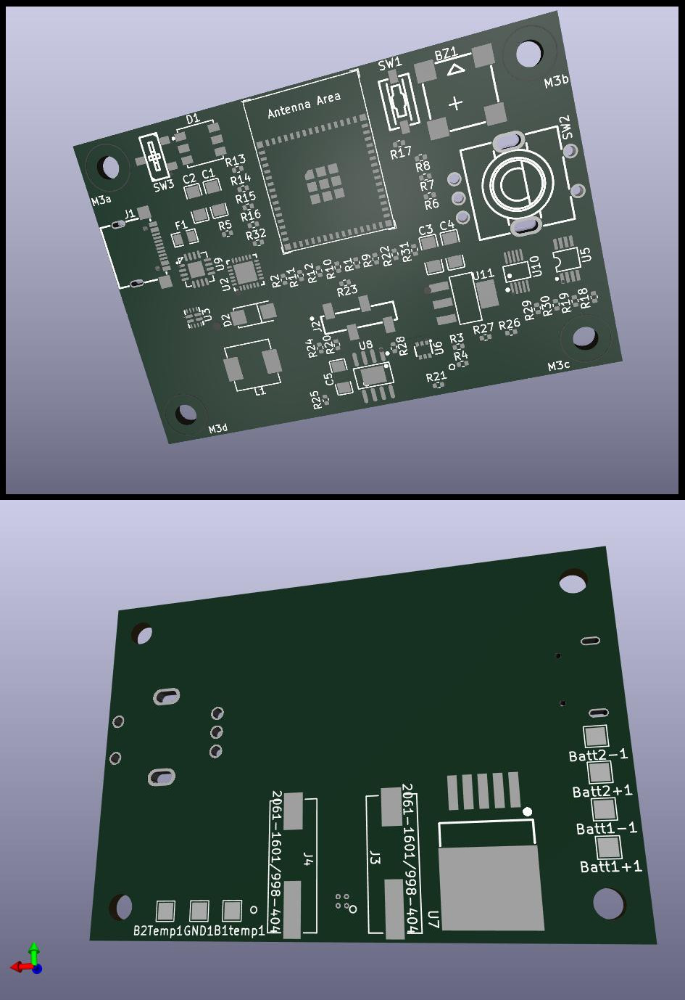

## Alaska-Deluxe-Generator

### A Self-Contained Laboratory Grade Colloidal Generator - For Alaska *and beyond*.


#### First, let's get this out of the way: Located here are plans for a device intended to generate nanoparticle (1-5 micron) metals in an ionically stable aqueous solution. This product is not intended to treat, or cure any disease. How you use the solution that it can make (operated according to specifications) is entirely up to you. Do your own research, Take responsibility for your own health> Use at your own discretion. There can be risks involved in everything. You are responsible. No links or referenes posted here are meant to recommend, endorse, advocate, advertise, or promote any specific protocol for your own uses. These are items you must determine. Thank you for your attention. And now...

#### We just want you to have the ability to produce lab quality colloidal products when alternatives are unavailable, difficult to obtain, or inferior.

Peek at a rough layout of the SH1106 OLED screen (128x64) 
As you can see below, there is a lot of pixel space to be organized and utilized more fully.
screen (128x64)
```
┌──────────────────────────────────────────────┐
│  Colloidal Electrolysis Generator v0.2       │
│                                              │
│  Out: 17.5 V     1.10 A     19.3 W           │
│  Polarity:  ───►  POSITIVE                   │
│                                              │
│  Set: 17.5V   Time: 60min                    │
│  Elapsed:  00:27:14                          │
│  Remaining: 00:32:46                         │
│  ██████████░░░░░░░░░  45%                    │
│                                              │
│  Press encoder to stop                       │
└──────────────────────────────────────────────┘
```
Until I master the art of Markdown, the following will look simple.
***
### Some cool features we have already: (Not in order of priority)
- Designed to take any input up to 25v maximum input or thereabouts - safe for almost any standard DC input range
- Full PD compliant input options - auto select input Vpos from PD delivery
- External 12-bit ADC 0.8mA steps - shunted, super accurate power control to the process
- Full power protection of electronics - both ends (Input and Output)
- Super accurate INA219 power measurements of Battery Voltage (capacity)
- Super accurate power measurement of generated power signal
- Ambient temperature sensor for accurate calibration of electrolysis efficiency
- Automatic conductivity measurment for accurate addition of electrolyte - ex. Maltodextrin (7 drops)
- Accurate conductivity measurement of solution both *prior* and *during* production
- Monitored control of power during cycle to reach target PPM in the timeframe of the cycle
- Auto safety shutoff if power goes out of spec IN or a shorted electrode contition during OUTPUT
- 2x18650 cells probably LiIon
- WiFi hostAP mode or WiFi client to connect to home network
- http interface - to manage, to monitor, and maybe a lot of other things to extend functionality
- beeper to signal stuff - start/stop/warning also helps visually impared and maybe Dogs
- RGB LED to signal ready, generating, finished, and warning. maybe other signals
***
### Features that will be appearing in a short time:
- Customizable recipe scripts easily uploadable via web interface for *Multi-metals* - more about this later!
- QR code on screen with unique pseudo-random password for local Host AP mode connection - sort of a layer of security
- Auto shutoff (early) if PPM is achieved before cycle end - may require additional hardware modification/version
- Modular/modifiable battery configuration in case you have alternate supply chains - may require hardware modification/version/case
- Battery Management - utilizes Ultra Low Power (ULP) mode to extend standby time
- HomeAssistant integration - this may also enable hearing impaired folks where the buzzer is useless
- Batch management for HomeAssistant - Type of colloidal and stock on hand for wilderness medics and remote uses for example in Alaska ;-)
- Bluetooth pairing sequence - for possible upcoming smartphone app release - also to aid hearing impaired wtih phone haptics
- Logging of batch production for analysis stored in spare memory on device - in easily graphable format - humans like pictures
- Logging of battery charge/energy usage for the ultra OCD perfectionists, hackers, modz
- 4x 18650 LiFePO4 in 2S2P (7.2v) battery charge management (3000-7000 charge cycles, (8-10y of daily use), Operation. in -30°C with LiFEPO4
- Peltier TEC to recapture 80-360mW waste heat back to BMS while generating (extends runtimes 2-6x, or adds __weeks__ in standby)
***
### Some ideas for "flashy" attractive things that humans like:
- RGB rotary encoder for visual signalling (hearing impaired), disable in menu to save battery
- Cool case designs - As many as are useful, creators retain full credit for work
- Possible LoRA wireless model - in case you need to step away
***
### First pre-production-ready release (very soon Q1-Q2 2026)
- Full KiCad project (schematic + PCB, gerbers, BOM, CPL)
- ESP32-S3 firmware (deep sleep, PPM, multi-metal) in a file, easily upgradable from http interface
- 3D renders + mason-jar lid STL

***
### Needed:
- Money for Plasticity - Commercial subscription
- Repository of swanky case designs for 3D printing a case
- A logo or something unique to give identity

I would like to offer "Custom assembled" beta versions if you just can't wait for a crowd funded production unit. These would be for contributing members of this project, money, or crypto would be an acceptable contribution.
    
```
Alaska Deluxe Colloidal Generator – Terrestrial Edition
Copyright (C) 2025 [Your Real Name or Handle]

This program is free software: you can redistribute it and/or modify
it under the terms of the GNU General Public License version 3 as
published by the Free Software Foundation.

This program is distributed in the hope that it will be useful,
but WITHOUT ANY WARRANTY; without even the implied warranty of
MERCHANTABILITY or FITNESS FOR A PARTICULAR PURPOSE.
See the GNU General Public License for more details.

You should have received a copy of the GNU General Public License
along with this program. If not, see <https://www.gnu.org/licenses/gpl-3.0.html>.

Co-designed with Heinsight and Grok (xAI) – November 2025
