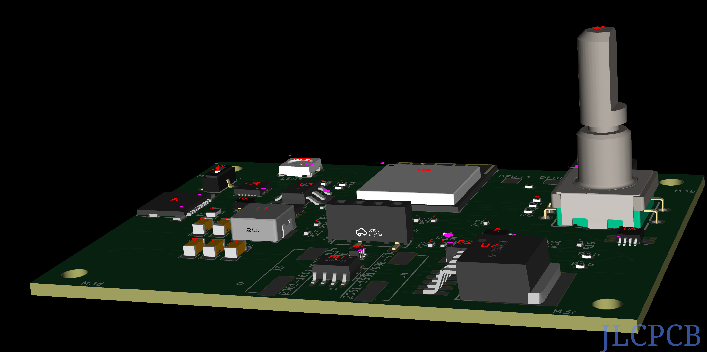

## Alaska-Deluxe-Generator

Updated: 1/7/2026

Pre-orders coming very soon (getting closer, just a few more days)

### A Self-Contained Laboratory Grade Colloidal Generator - For Alaska *and beyond*.


#### First, let's get the legal stuff out of the way: Located here are plans for a device intended to generate nanoparticles (1-5 micron is ideal) in an ionically stable aqueous solution. This product is not intended to treat, or cure any disease. How you use the solution that *you* make (operated according to specifications) is entirely up to you. Do your own research, Take responsibility for your own health> Use at your own discretion. There can be risks involved in anything. You are responsible. No links or referenes posted here are meant to recommend, endorse, advocate, advertise, or promote any specific protocol for your own uses. These are items you must determine. WE will make a good device with default setting that are "safe" for people who use stuff without reading the directions. Thank you for your attention to these things.

And now...

#### Our goal is for you to have the ability to produce *excellent quality* colloidal products when alternatives are inferior, difficult to obtain, or unavailable. *THIS* device produces solutions that are far superior to any pressed pill, maximizing bioavailability with extremely low contaminants. You can achieve the highest level of satisfaction by reading ALL the documentation and instructions that we will provide.

****The hardware is designed to give you a complete colloidal electrolysis workshop.****
For the DIY inclined, purchase the board and download the CAD/STL/STEP/Board measurement files (for free) and print your own case, your own design. Print it the way you like.
You can choose your own battery chemistry and size.
You can modify the code we provide on your own. Change it, upload it. No restrictions. No planned obsolecense.
If you break the screen, order another, open the case, and swap out broken one.

As you can see below, there is a lot of pixel space to be organized and utilized more fully.
The screen is 128x64. We will *try* to have intuitive icons and symbols, fast updates, and pragmatic logical information at a glance. Again, you can customize as you wish.

```
┌──────────────────────────────────────────────┐
│       Colloidal Electrolysis Workshop        │
│                                              │
│  Out: 27.5 V     15.10 mA    5.3 W           │
│  Polarity: FORWARD                           │
│                                              │
│  Start set: 17.5V   Time: 60min              │
│  Elapsed:  00:27:14                          │
│  Remaining: 00:32:46                         │
│  ██████████░░░░░░░░░  45%                     │
│                                              │
│  Press selector to stop                      │
└──────────────────────────────────────────────┘
```
You can use this device to read the advertized capabilities of any PD device that uses USB-C connector
```
┌──────────────────────────────────────────────┐
│               PD Input Report                │
│                                              │
│  PD Input Advertisement:                     │
│                                              │
│  5V: 2A                                      │
│  9V: 3A                                      │
│  12V: 5A                                     │
│  15V: 3A                                     │
│  20V: 5A                                     │
│                                              │
│  Press selector to return to menu            │
└──────────────────────────────────────────────┘
```

### Some cool features we have already: (Not in order of priority)
- Built on the reliable ESP32-S3-Mini1 MCU with
- Full RF Certification
- Ultra-low power capabilitity, Dual-core processor
- Designed to take either PD or battery input
- Awesome battery charging: limit LiIon/LiPo "full" charge between 20%-90% to prolong battery health
- Rugged USB-C interface - Durable long life use!
- Sturdy/Rugged rotary encoder button (ALPS EC11)
- WAGO - Top quality rugged electrode socket (Made in USA)
- Field replacable OLED screen 128x64px
- Super accurate power measurement and monitoring
- Robust programmable battery charging and protection controllable in menu 
- Full PD compliant input options - auto selecting input votage from available PD up to 20V
- Full power protection of electronics - from PD/battery input to electrode output
- Super accurate power measurement capabilities which *allow* TONS of cool features:
  - Internal battery power input measurement and charging with charging profile control (TP5100)
  - PD input query (STB4500) and display from the PD source (ex. 5v,9v, 12v, 15v, 20v)
  - Power Output feedback measurement from/to the electrodes (INA226) (Realtime capable)
- Continuous, dynamically adjustable power from menu, leveraging the MCP4017, XL6019, DRV8872
  - MCP4017 digital variable resistor for fine grained power output
  - XL6019 provides boost/buck to handle input range and provide stable output
  - DRV8872 allows for flipping the polarity of the electrodes to eliminate buildup, and produce the smallest partcles and cleanest solution
- Ambient temperature sensor for accurate calibration of electrolysis process AND to monitor 2 battery temperature sensors
- Automatic conductivity measurment for accurate addition of electrolyte (example: Add 7 drops, measure, add 2 drops, measure, etc.)
- Accurate monitoring of solution *prior to and during* the process to calculate the PPM level and progress, time to complete, and stop when PPM reached
- RGB LED for signalling status - many, many colors to choose from (ex. RED=ERROR, colors friendly to "color blindness", and blinky/flashing)
- buzzer/beeper to signal stuff - start/stop/warning also helps visually impared and maybe Dogs
- *AUTO SHUTOFF* if power goes out of spec (ex. a shorted electrode contition during OUTPUT, or a power fault from INPUT, battery fault)
- Modular/modifiable battery configuration: 1x 4.8V or 2x 4.8V (8.4v) cells. Choose your battery chemistry (18650 LiION, prismatic)
- Note: battery options are built into the design, adding a battery is an optional upgrade
- RGB LED to signal ready, generating, finished, and warning. maybe other signals

****A Note about why I did not add a battery****
TLDR: Yes, you can do it with this board. But it's cheaper/easier to buy a battery bank with good PD support.

The onboard battery explanation: In my wild dream, I thought about adding a battery on board that someone would one day want to buy this and stash it in an off-grid cabin. I imagined a 100w solar panel and this seasonal cabin may be uninhabited for 6-9 months at a time. Knowing what I know about the ESP32 S3 and deep sleep mode, it would be totally possible to expect a good amount of the charge to still be available upon returning to the cabin and needing some colloidal copper, or silver. So, I did choose the components to make this a real possibility. However, for the prototypes I dropped the integration of an on-board battery to soften the initial hardware investment and focused on the USB-C and PD (Power Delivery). This was after I had spent time researching (costs) 10k to 25k mAh portable battery banks. There are several models available (Anker, UGREEN, INIU, Scharge Shargeek) supporting great PD (5V,9V,12V,15V,20V) at 45W+ that would provide 20V at minimum 1.5A which is sufficient for running the unit for several batch cycles. Expect at least 5 Gallons (20x 1qt. mason jar cycles) with a 25,000 mAh battery pack before needing recharge.

***
### Features that will be appearing in a short time:
- NEAT-O http interface - to manage, to monitor, and maybe a lot of other things to extend functionality
  - I'm thinking a colloidal generator farm with at least 20 units running simultaneously output 5gal/hr.
- WiFi hostAP mode or WiFi client to connect to home network
- QR code on screen with unique pseudo-random password for local Host AP mode connection - sort of a layer of security
- Customizable recipe scripts easily uploadable via web interface - *Multiple options of nano-particle colloidals*
- Auto shutoff (early) if PPM is achieved before cycle end
- Battery Consumption Management - utilize Ultra Low Power (ULP) standby mode to extend battery readiness time
- HomeAssistant integration - this may also enable hearing impaired folks where the buzzer is not useful
- Batch management for HomeAssistant - Type of colloidal and stock on hand
- Bluetooth pairing sequence - for smartphone app (Release TBD) - also to aid hearing impaired via phone haptic feedback
- Logging of batch production for analysis - possible label or QR code generation linking to the batch logs
- Logging of battery charge/energy usage for the ultra OCD perfectionists, engineers, modifications, etc.

***
### Some ideas for "flashy" attractive things that humans like:
- Cool case designs - As many as are useful, creators retain full credit for work
- extendable to multi-unit production farm for bulk production
  
***
### First pre-production release (very soon Q1-Q2 2026)
- Hardware design (alpha version) FINISHED
- Full KiCad project FINISHED (schematic + PCB, gerbers, BOM, CPL)
- ESP32-S3 firmware IN PROGRESS
- 3D STL case FINISHED
- Mason-jar mouting lid/bracket in STL (3D printable format) IN PROGRESS

***
### Needed:
- Repository of swanky user submitted case designs for easy 3D printing
- A logo or something unique to give identity

I would like to offer "Custom assembled" beta versions of the hardware if you just can't wait for a production unit.
These would be for contributing members of this project, money, or crypto would be an acceptable contribution.
    
```
Alaska Series Colloidal Generator – Terrestrial Development Edition
Copyright (C) 2025 Nathan Hein

This program is free software: you can redistribute it and/or modify
it under the terms of the GNU General Public License version 3 as
published by the Free Software Foundation.

This program is distributed in the hope that it will be useful,
but WITHOUT ANY WARRANTY; without even the implied warranty of
MERCHANTABILITY or FITNESS FOR A PARTICULAR PURPOSE.
See the GNU General Public License for more details.

You should have received a copy of the GNU General Public License
along with this program. If not, see <https://www.gnu.org/licenses/gpl-3.0.html>.

Co-designed with Heinsight and some help from Grok (xAI) – November 2025
